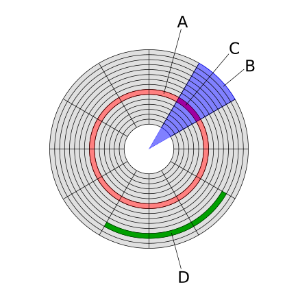

# 기존에 알고있는 키워드
- 하드디스크 
    - CD와 같이 물리적으로 돌아가는 방식이므로 근원적인 속도의 한계 존재(RPM) 
    - sata 방식으로 cpu와 직접적인 소통을 하는 것이 아닌, 디스크 컨트롤러라는 중간 부품을 한번 더 걸쳐야한다. 
    - 배드섹터의 개념이 존재
- ssd 
    - hdd와 달리 반도체의 형태이다. 그렇기 때문에 기계적인 곳으로부터 오는 속도제한에서 비교적 자유롭다 
    - 앞서 말한 속도의 차이 때문에 pcie방식을 이용하고, 디스크 컨트롤러없이 cpu와 직접 내통한다. 
    - 디스크 조각 모으기가 ssd에서는 불필요한데, 이는 파일의 단편화의 차이 떄문이다. 

# 하드디스크의 섹터
섹터는 기본적인 저장단위(512바이트)이자, `물리적`인 단위임. 

여기 위사진에서 B가 우리가 흔히 말하는 섹터로, 사용자의 데이터와 오류 검출 코드 그리고 디스크와 디스크 컨트롤러에게 위 주소에 대한 정보를 주기 위한 주소 식별 등의 내용을 담고있다. 
또한 클러스터는 이러한 섹터를 여러개 묶은 것으로, 파일 시스템이 보다 원활하게(효율적으로)데이터를 관리할 수 있도록 탄생한 개념이다.
## 배드 섹터
배드 섹터는 위에서 말한 섹터라는 저장공간에 손상이 가해진 상태로, 물리적인 배드섹터와 논리적인 배드 섹터가 존재한다.
### 물리적 배드섹터
물리적인 배드섹터는 말 그대로 물리적인 충격에 의해 발생한 경우다. 
#### 파워의 문제
파워 서플라이에서 일정하게 정격의 전원을 hdd에게 공급해주지 못한다면, 전압이나 전류가 불규칙적으로 공급되기 때문에 문제가 생길 수 있다.
#### 섹터의 충격
하드디스크가 파일을 기록하는 방식은 레코드판의 원리와 유사하다. 따라서 헤드가 플래터를 긁거나, 하드디스크의 섹터가 균일하지 않게 닳아버리는 경우에도 배드섹터가 발생할 수 있다.
### 논리적 배드섹터
논리적인 배드섹터는 위에서 말한 경우와 달리 컴퓨터를 강제종료하거나 소프트웨어가 꼬이는 일 등에 의하여 발생한다.

# **디스크 조각 모으기**
디스크 조각 모으기가 **HDD에서만** 성능을 개선할 수 있는 이유는, **파일 단편화**와 **파일을 쓰고 저장하는 방식**의 차이 때문입니다.

## **HDD의 저장 원리**
하드디스크는 데이터를 **물리적인 단위인 섹터와 트랙**에 저장합니다. 트랙은 여러 개의 섹터로 이루어져 있습니다. 데이터를 저장할 때, HDD는 가능한 **연속된 빈 공간**을 사용하려고 하지만, 다양한 이유로 빈 공간이 연속적이지 못한 경우 **성능 저하**가 발생할 수 있습니다. 이는 HDD의 **기계적 특성**과 연관이 있습니다.

### **파일 수정과 단편화**
파일이 수정되거나 크기가 변경될 때, 특히 **파일 크기가 증가**하면, 기존의 연속된 공간을 초과하여 저장해야 할 경우 파일이 **여러 섹터에 분산**됩니다. 이로 인해 **단편화**가 발생하게 되며, HDD의 **헤드 이동**이 많아지면서 성능 저하를 유발할 수 있습니다.

## **디스크 조각 모으기의 원리**
**디스크 조각 모으기**는 **단편화된 파일을 연속된 섹터에 재배치**하여, 성능을 개선하는 작업입니다. HDD는 데이터를 읽고 쓸 때 **기계적인 이동**이 필요하므로, **연속된 빈 공간**에 데이터를 저장하면 **헤드의 이동**을 줄여 **파일 접근 시간**을 단축시킬 수 있습니다. 이를 통해 HDD의 전반적인 성능이 향상됩니다.
