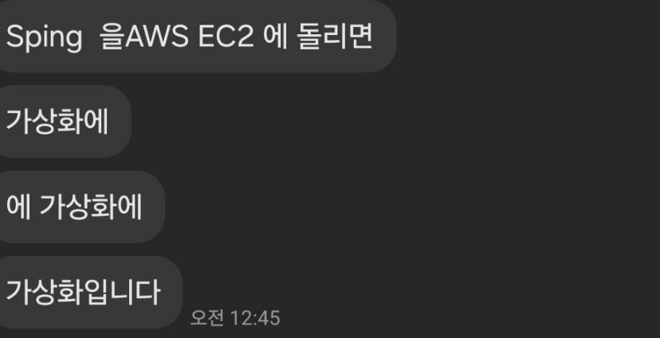

# 레퍼런스
- [jvm의 구성요소 설명 참조](https://jiwondev.tistory.com/69) 
- [jdk와 jre, jvm기본 토대 잡기](https://inpa.tistory.com/entry/JAVA-%E2%98%95-JDK-JRE-JVM-%EA%B0%9C%EB%85%90-%EA%B5%AC%EC%84%B1-%EC%9B%90%EB%A6%AC-%F0%9F%92%AF-%EC%99%84%EB%B2%BD-%EC%B4%9D%EC%A0%95%EB%A6%AC) 
- [클래스를 로드한다?](https://velog.io/@ddangle/Java-%ED%81%B4%EB%9E%98%EC%8A%A4-%EB%A1%9C%EB%8D%94%EB%9E%80) 
[스프링과 도커](https://velog.io/@min-zi/Spring-%EB%8F%84%EC%BB%A4)
# 짤로 보는 가상화
 
일요일-월요일 넘어가는 때에 문 떡밥 카톡을 이제야 주워먹는 양심없는 물고기의 삶이란 이런 것이다. 
자바가 가상머신이면 spring을 aws ec2에 올리면 가상화에 가상화에 가상화가 된다는데 그럼 자바-스프링에서 가상화1 aws가상화1 ec2 가상화1 이렇게 해서 가상화의 cnt가 3으로 느는걸까? 
그런데 이것보다 더 놀라운 것이 있으니 그럼 자바의 컴파일 시스템이 특이한 것이냐고 질문하자 컴파일과 가상머신은 별개라는 대답만 돌아왔다.
# JDK?? JVM
그렇다, 나는 아무것도 모른 채로 코틀린을 하던 멍청한 코린이어서 전에도 자바와 가상머신이라는 키워드는 들었으나 그때엔 `JDK==언어팩` 그리고 `JVM==가상머신`으로 대충 이해를 하고 넘어갔다. 
미리 언급하자면 jvm은 가상머신이 맞으나, `JDK!=언어팩`이다.
## JVM
jvm은 자바를 돌릴 수 있도록 도와주는 가상머신이다. 
나는 자바를 깐 게 한 4년전인가 3년전인가 이래서 잘 기억이 나질 않았는데, JDK를 깔면 알아서 jre가 jvm과 함께 설치된다고 한다.
### 왜 굳이
미리 스포일러를 하자면, 자바가 o/s에 종속되지 않는다는 이점을 가지는 것도 jvm덕분이며 자바 프로그램의 컴파일 속도가 c언어보다 대략 두배정도 느린 것 역시 JVM덕분(?)이다.
### 운영체제에 종속되지 않는다
c언어로 짠 코드의 경우 다른 o/s에 이식을 시키기 위해서는 o/s의 비트수와 같은 것들에 대한 세팅값을 건드린 후 빌드하는 작업을 반복하여야만 한다. 
그러나 자바의 경우 컴파일이 완료된 파일을 jvm 위에서 구동을 시키는 원리이기 때문에 한번만 온전한 컴파일 파일을 만들고, jvm을 거치면 어디에서든 사용 가능하다.
### 어떻게 이런 게 가능한가요
c언어는 `바이너리 코드->하드웨어가 이것을 읽음->기계어`의 과정이 있다. 
그런데, 이렇게 되니 생기는 문제가 바로 저 하드웨어에 의해 기계어가 생성되다보니 window냐 linux냐에 따라 변환의 결과에 대한 해석값이 달라지는 것이다. 
그래서 자바는 jvm이라는 가상 머신을 사용하여, 바이너리 코드를 기계어로 변환하는 과정에서 모두 똑같은 번역을 내놓도록 만든 것이다.
### 구성요소
jvm의 구성요소는 클래스로더/실행엔진/가비지 콜렉터로 나눌 수 있다. 
그리고 마지막으로 `런타임 데이터 에어리어`라는 메모리 할당 영역이 나온다.
#### 가비지 콜렉터
가비지 콜렉터를 짧게 설명하자면, 메모리를 알아서 할당하고 메모리 할당을 알아서 해지해주는 기능이다. 
그래서 자바에서는 `malloc/calloc/realloc/free`등이 없어도 나름 효율적으로 알아서 잘 굴러갈 수 있다.
#### 클래스 로더
> 클래스를 로드한다는 과연 어떤 의미를 가질까? 
간단하게 설명하자면 클래스에 대한 정보를 런타임 데이터에 저장하여 이후 실행 검증 해석을 쉽게 하겠다는 의미를 가진다.

자바의 경우 이러한 과정을 동적으로 진행하기 때문에, 미리 메모리를 비워놓지 않아도 되므로 효율적이다.
# 스프링과 가상화
스프링의 의존성 주입은 객체간의 관계를 외부에서 정의함으로써 이루어진다. 
그렇기 때문에 객체간의 관계를 외부에서 설정하면 보다 애플리케이션을 쉽게 이식할 수 있다.