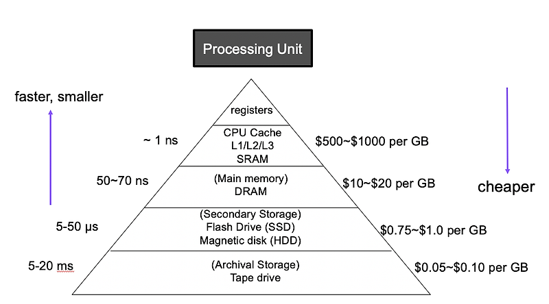

# 레퍼런스 및 참조
- [캐시 설계 및 기본 특징](https://park-yina.github.io/categories/jungle/Til4) 

# 캐시 메모리는 중요하다
캐시 메모리는 `병목현상`을 해결하기 위해서 존재한다. 
그렇기 때문에 L1/L2/L3는 각각 다른 속도를 가져야만 하며 cpu에 가까운 쪽일수록 빠르고 dram에 가까워질수록 느려진다(이 말만 한 10번 필기중인듯) 
그리고 캐시 메모리를 다룰 때에 꼭 가지고가야하는 키워드가 `지역성`이다.
## 지역성
이후 나올 캐시 메모리 설계시 고려사항들의 출발지점은 대부분 캐시메모리가 지역적이라는 데에 있다. 
이 지역성은 두 개의 종류로 나뉘는데 `시간적 지역성(지금 이 데이터를 사용했다면 가까운 미래에 다시 사용할 확률 높음)`과 `공간적 지역성:어떤 데이터가 사용되었으면 그 인근의 데이터가 사용될 가능성 높음`이 있다. 
그리고 이 두가지를 고려해야하는 이유 역시 캐시는 개 작고 개 비싸기 때문에 효율적인 설계가 중요하기 때문이다.
## 어디에?
맨 처음 책을 들춰보면 캐시가 dram과 cpu사이에 위치하는 것처럼 보인다. 
그러나 캐시는 병목현상이 존재할 여지가 있는 곳이라면 어디든 존재할 수 있다.
# 스마트 캐쉬
스마트 캐쉬는 조금 특별한 개념중 하나인데, 캐시 메모리가 부족할 때에 dram의 용량 중 일부를 캐시메모리처럼 끌고오는 방식이다.
# 기본적으로 설계시 고려사항
캐시 메모리 설계시 고려해야될 큰 키워드는 4개 정도가 있다.
## 검색법
캐시에서 데이터를 찾는 방법을 결정하는 규칙이나 알고리즘 
일반적인 검색법으로는 직접매핑과 세트 연관 매핑이 있다.
## 어디에 설계할까
주어진 캐시를 어디에 자리잡을 것인가에 대한 고민을 담아야한다.
## 페이지 교체
캐시 메모리는 제한적이므로 교체를 해야하는 경우가 생긴다. 
이때에 빈공간을 어떻게 만들 것인가(즉 어떤 방식으로 데이터를 삭제하고 어떤 방식으로 데이터를 넣을것인가)에 대한 계획을 세워야만 한다.
## write
위에서 말한 것과 마찬가지이므로 생략
# 모든 메모리는 계층 구조를 외운다
`10년차 임베디드 지인` 오피셜 1장에서 꼭 가져가야하는 키워드 중 하나이다. 
모든 메모리는 다음 단계에서 해야할 일에 대한 것들을 미리 저장해두는 방식으로 이루어져있다. 
이것에 대한 이해를 잘 갖추고 있다면, 아마 책에서 나온 그림 정도는 충분히 납득 가능할 것이다.

통상적으로 위쪽으로 갈수록 가격이 비싸지고 용량이 작으며 아래쪽으로 갈수록 용량이 커지면서 비용이 싸지는 경향이 있다. 
대신 메모리 계층구조에서는 상단으로 갈수록 처리 속도가 빨라지기 때문에 자주 사용하며 교체가 작은 데이터들은 빠른 접근을 위해 위쪽 계층에 위치하도록 설계하는 것이 좋다.