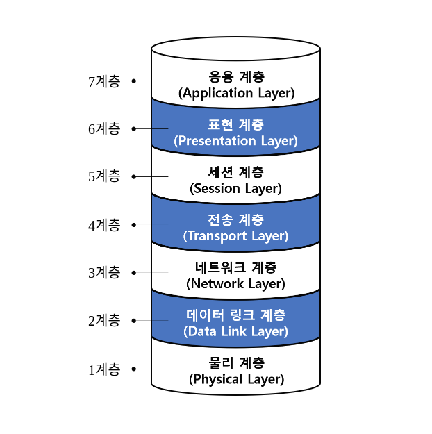

# 들어가기에 앞서
사실 굳이 3일차부터 이 osi의 7계층까지 들어가기엔 빡세보여서 미래의 나에게 맡겨둘 계획이었는데, cdn과 통신에 대해서 임베디드 개발자인 지인분께 질문을 드리니 cs:app1장 공부를 위한 개괄 및 공부 방향을 잡아주심과 동시에 osi의 7계층까지 수업을 해주셨다. 
무려 10시부터 밤 12시 정도까지 나를 위해 방향을 잡아주시면서, 팀원들한테도 꼭 말해요 삽질하지 말고 제발 그때그때 물어보라는 당부까지 해주시며 엄청난 분량의 ppt를 수업해주신 니나농님께 정말 진심으로 감사를 드린다. 
[니나농님 네이버 블로그 바로가기](https://blog.naver.com/dhtpals32123) 
참고로 이 공부자료도 니나농님께서 내게 배포해주신 자료로 내 공부를 위해 만든 게시물이다...
# OSI7계층
네트워크도 일종의 계층 구조를 이룬다. 
메모리를 이해할 때에도 우리가 계층구조를 그렸듯 네트워크도 디테일을 보기 이전에 큰 숲을 먼저 구조적으로 도식화하여 알아본 다음에, 디테일을 채워나가는 것이 중요하다.
## 기초 용어
### 서버와 클라이언트
정보를 주는 쪽과 받는 쪽을 각각 서버와 클라이언트라고 한다. 
그리고 내가 저번 글에서 언급하였듯 프록시는 대리 서버로, 이 둘의 중간에서 중계자의 역할을 해준다. 
나중에 네트워크에 관련하여 심화적인 공부를 하면서 한번 더 다루겠지만 프록시에서도 어떤 정보를 차단해줄 수 있다고 해서 방화벽과 같은 거 아닌가라고 생각을 하면 절대 안된다. 
### ip와 포트
ip는 일종의 주소이다. 
이후 mac이라는 또다른 개념의 주소가 나오는데(뭔 놈의 주소가 이렇게 많냐 싶지만)ip는 유동적 ip와 고정 ip가 있어서 고유번호를 가지고는 있으나 변하지 않는 것은 아니다. 
한 마디로 요약하자면 ip는 `네트워크 상에서 다른 컴퓨터와 구별하도록 도와주는 고유번호`와 같은 것이다. 
#### 포트
포트는 ip내에서 애플리케이션을 상호 구분 하기 위하여 사용하는 번호이다. 
원래는 그래서 포트는 프로그램당 하나만 열 수 있다. 
그런데 80번 포트 예외여서 간혹 localhost는 두개 켰는데 왜 됐지 싶다면, 아마 80번 포트를 통해서 작업했을 확률이 크다.
# OSI 7계층 전체 정리

전체 사진을 보면 이렇게 이루어져있다. 
저 이름만 보고 사진을 보면 아니 도대체 어떻게 저걸 하루만에 외우셨지 싶을 수 있지만, 솔직하게 말하자면 나도 이해를 하고 넘긴 정도여서 달달달달은 안된다. 
대신 사진을 보면 설명이 가능하고, 각 계층에 어떤 것이 속하는지에 대해 외울 수 있을 정도로만 일단 공부를 해두었다.
## 1계층-Physical
1계층은 물리적 연결 계층으로 대표적인 디바이스로는 허브가 있다. 
통신을 하기 위해 물리적인 기계를 연결하는 계층이라고 이해하면 된다.
## 2계층-데이터 링크 계층
1계층에서 물리적으로 기계를 연결했으면, 이제 데이터들을 엮어서 목적지로 전달해주어야 할 곳으로 연결을 해주어야한다. 
이 2계층에서는 데이터에 대한 오류 검증도 이루어지며, MAC주소라는 고유의 주소값 을 사용한다.
## 3계층-네트워크 계층
이름과 마찬가지로 2계층에서 link해둔 데이터를 라우터를 통하여 가장 안전하고 빠르게 전달하는 임무를 담당한다. 
IP주소를 기반으로 대상을 지정한다.
## 4계층-전송 계층
3계층에서는 ip주소를 기반으로 보내야할 대상을 지정하고, 4계층에서는 효율적으로 정보를 전송하기 위한 일들을 진행한다. 
이 4계층에서는 눈여겨 보아야하는 키워드가 두개 있는데 바로 `TCP/UDP`이다.
### TCP
TCP는 동기방식으로 WAN을 기반으로 작동한다. 
참고로 뒤에서 나올 UDP에 비해 느린데, 그렇다고 막 엄청 느리다고 상상하면 곤란한 게 파이어베이스에서 제공해주는 리얼타임 데이터 베이스 역시 TCP방식이다. 
이 부분에 대해서는 내가 잘 모르긴하는데, 아마 느리다의 기준이 내가 생각하는 것처럼 개 느리다 이런 건 아닌가보다.
### UDP
주로 게임에서 사용을 한다. 
총을 발사했는데 한참 뒤에 총알이 빵 하고 날라가면 속된 말로 얼마나 개 빡치겠는가? 
하지만, 빠르다고 무조건 좋은 것은 아닌게 UDP방식은 비 신뢰적이고 실시간이라는 특징이 있기 때문에 LAN에서의 사용을 권장한다.
## 5계층-세션계층
대표적인 예로는 API가 있다. 
주 지점간의 통신을 유지하거나, 생성 종료 등을 담당하는 부분으로 이후 나올 6계층을 위한 필터 혹은 세션이라는 단어 그대로 송수신 연결상태에 대한 담당을 한다. 
참고로 위 계층에서 사용되는 필터링 판단의 주체는 o/s이다.
## 6계층-표현계층
표현방식을 정한다. 
파일의 형식 및 일부 암호화를 담당하는 영역으로 인코딩과 디코딩이 대표적인 예시이다.
## 7계층-응용계층
최종 목적지로, 여태까지의 걸러지고 확실해진 정보들을 바탕으로 응용 프로세스와 직접 관여하여 우리가 생각하는 서비스를 실행시킨다. 
여기에서 사용되는 것이 우리가 익히 알고있는 http/https프로토콜이다.